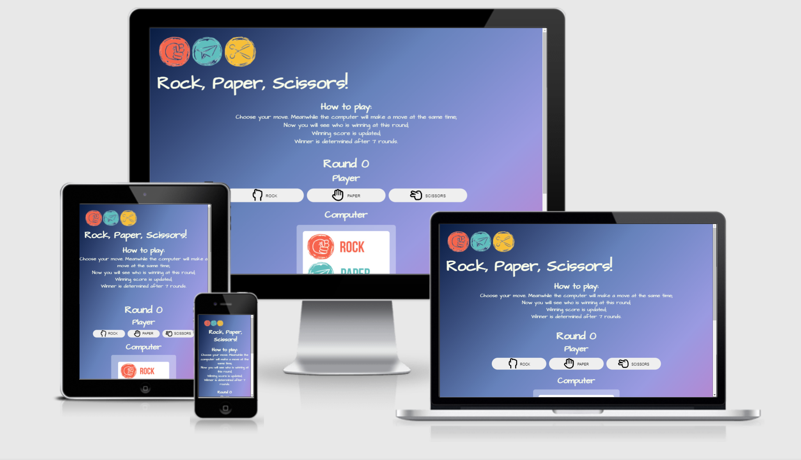

# Let [Rock, Paper, Scissors](https://maya-claveau.github.io/PP2-rps/) bring all the good memories back from your childhood 

Many of us are familiar with this game, we can even call it a classic. If you were born in the 80s like me, then you would remember that there weren't any electronics around like today, we'd play outside all day with our friends, and the rock, paper, scissors game is one of the most popular ones amongst many others. And very often, this little game also functions as a perfect solution for who starts first for a different game that we were planning to play. Over time, we became pro at it. The funny thing is that, as a pro you don't have much advantage over the beginners, the chances are almost the same. Here is why I chose to do this. Because of the global pandemic, we were advised not to gather, social distance, etc, for us human beings, this will make us feel lonely some time. My objective is to build this good old classy game, so you can play it wherever and whenever you would like. Hoping to bring back some of your great memories of your childhood and finally to cheer you up a little in this uncertain time.