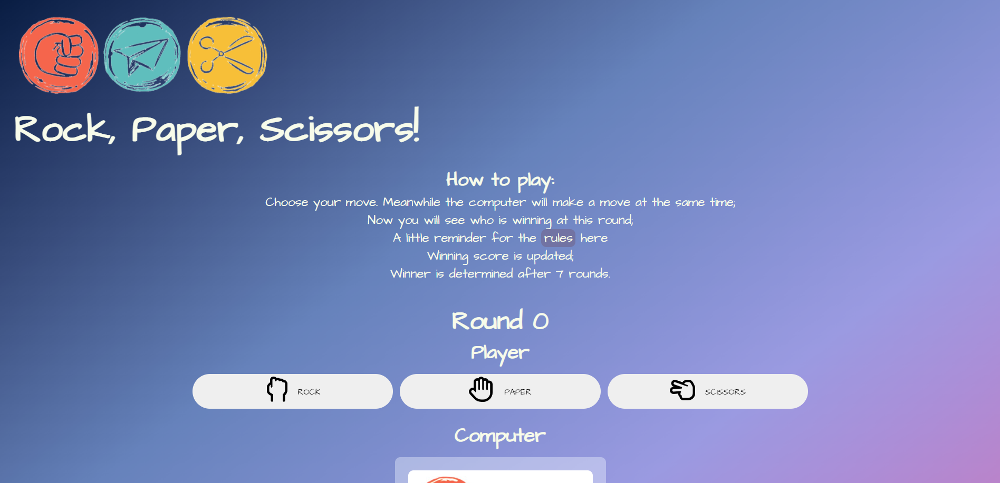

# Let [Rock, Paper, Scissors](https://maya-claveau.github.io/PP2-rps/) bring all the good memories back from your childhood 

This was built with the intention of entertaining the player, with a classic game from almost everyone’s childhood. Main objectives are: 

- to cheer up the player's mood
- to challenge the computer’s logic 
- to sharpen the player’s prediction skill 
- and most importantly to have fun

------

## Why This

Many of us are familiar with this game, we can even call it a classic. If you were born in the 80s like me, then you would remember that there weren't any electronics around like today, we'd play outside all day with our friends, and the rock, paper, scissors game is one of the most popular ones amongst many others. And very often, this little game also functions as a perfect solution for who starts first for a different game that we were planning to play. Here is why I chose to do this. Because of the global pandemic, we were advised not to gather with people, keep social distance, not to travel etc, basically to reduce the spread, each family needed to form and live their own babbles. For us human beings, this of course will make us feel lonely sometimes. My objective is by building this good old classy game, the player can play it wherever and whenever they would like. Hoping to bring back some of the great memories of your childhood and finally to cheer you up a little in this uncertain time.

------

## Features:
### Existing Features:
#### Home page:

First thing you see when you land on the website is the logo on the top left side with the title Rock, Paper, Scissors below it. Followed by the instructions of the game. Then you will come to the game area where the number of rounds are showing, so you know how many are left until the game is over. 

 

  
 

You have 3 options to choose from, so make your decision wisely. The computer will also make its choice the same time you make yours, so fair game for everyone. The winner for that round will get a point, when round 7 is completed, there will be a message informing you whether you are the winner or … you know.  

 

 
 
Now the “Play again” button will be clickable, so you can decide to play again or play again. You are welcome!

 

 
 
There is a small footer on the bottom left of the page, with information of copyright. And that's about it, this is only a single page project. Simple, easy and chill. 

 

### Features to be added later:
- the option to play against another player on two different devices
- if you lose 3 rounds in a roll, you are obliged to play another round
- the option to create an account, there you can add your friends and family, so you can play together no matter where you are

------
## Testing:
