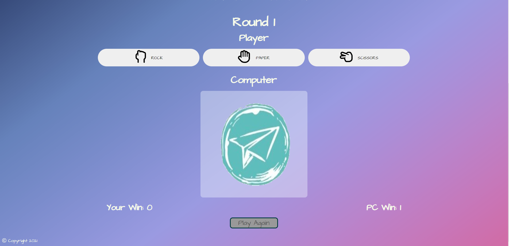
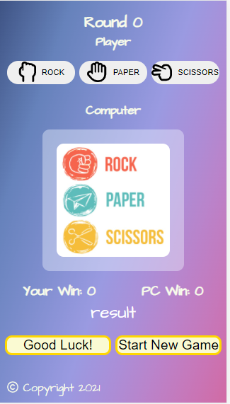
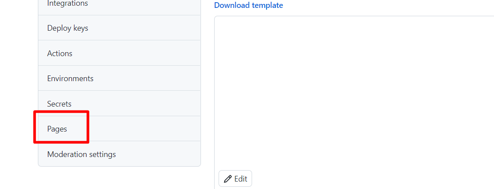

# Let **[Rock, Paper, Scissors](https://maya-claveau.github.io/PP2-rps/)** bring all the good memories back from your childhood 

This was built with the intention of entertaining the player, with a classic game from almost everyone’s childhood. Main objectives are:

- to cheer up the player's mood
- to challenge the computer’s logic 
- to sharpen the player’s prediction skill 
- and most importantly to have fun

------

## **Why This**

Many of us are familiar with this game, we can even call it a classic. If you were born in the 80s like me, then you would remember that there weren't any electronics around like today, we'd play outside all day with our friends, and the rock, paper, scissors game is one of the most popular ones amongst many others. And very often, this little game also functions as a perfect solution for who starts first for a different game that we were planning to play. Here is why I chose to do this. Because of the global pandemic, we were advised not to gather with people, keep social distance, not to travel etc, basically to reduce the spread, each family needed to form and live their own babbles. For us human beings, this of course will make us feel lonely sometimes. My objective is by building this good old classy game, the player can play it wherever and whenever they would like. Hoping to bring back some of the great memories of your childhood and finally to cheer you up a little in this uncertain time.

------

## **Features:**
### Existing Features:
#### Home page:

First thing you see when you land on the website is the logo on the top left side with the title Rock, Paper, Scissors below it. Followed by the instructions of the game.
 

 

 

By clicking the rule button, you will see the game rules in popup window.

 

  

Then you will come to the game area where the number of rounds are showing, so you know how many are left until the game is over.

You have 3 options to choose from, so make your decision wisely. The computer will also make its choice the same time you make yours, so fair game for everyone. The winner for that round will get a point, when round 7 is completed, there will be a message informing you whether you are the winner or … you know.

 

 

Now the “Play again” button will be clickable, so you can decide to play again or play again. You are welcome!

 

 

There is a small footer on the bottom left of the page, with information of copyright. And that's about it, this is only a single page project. Simple, easy and chill.
 

 

### Features to be added later:
- the option to play against another player on two different devices
- if you lose 3 rounds in a roll, you are obliged to play another round
- the option to create an account, there you can add your friends and family, so you can play together no matter where you are

------

## **Testing:**

Google dev tools became my first choice for testing purposes. I use it on a daily basis since the development stage. For instance:

- 
after added media queries for medium sized screens, it affected my mobile version for some reason and after some digging I finally fixed it. See screenshot below,

 

 

- 
the page went through major development progress as I was building it, my initial idea wasn't complete, and there are things I didn't consider. As I worked on it, more ideas came to my mind, with the help of fellow students on slack, my mentor, finally the website looked like a little more proper gaming site than what I had originally planned.
 

 

 

 

 

 

 

 

 

- 
when I need to write JavaScript code, the chance of it works as intended is very little for me. Without google dev tools and the help from others, this project won’t be existing. I will come back to it later.

 

------
## **Code Validation:**

- **HTML**
 
 First validation had one error, as show below,

 

Then I put the unordered list into one of the list items within the ordered list  and it worked. Second validation come out clean with 0 errors, see screenshot below,

 

- **CSS**

CSS validation went in nice and smooth, with no error in the first try, I don’t think it ever happened before, so I will take it as a win!

 

- **JavaScript**

JavaScript validation was tough, the first try gave me 24 warnings, and I almost had a heart attack.

Since the majority of the warnings are related to “let”, I assume it is not a big deal. With the help of fellow students on Slack, I managed to remove them. Now I have only one warnings left to deal with

After some research online and discussion with fellow student, I had better understanding of the issue, however I didn’t manage to fix it, which left me with no choice but to leave it here. Good thing is that it is a warning, not an error. So here is the final validation for JavaScript:

------

## **Language used:**

- HTML
- CSS
- JavaScript

------

## **Tools used:** 

- [Google Fonts](https://fonts.google.com/) for selecting the fonts for the project. I choose [Architects Daughter](https://fonts.google.com/specimen/Architects+Daughter?preview.text=step%201:%20choose%20your%20first%20move&preview.text_type=custom), because it looks a little childish and it matches with the type of game and my purpose of bringing back good memories from the childhood.

- [Font Color](https://mycolor.space/?hex=%23000000&sub=1) I used colorspace to pick the Small Switch Palette, which in my opinion is nice and simple, goes well with the playful background. The CSS code for background color is also generated from this website.

- [Am I Responsive](http://ami.responsivedesign.is/?url=https%3A%2F%2Fmaya-claveau.github.io%2FPP2-rps%2F) for making the responsive screenshot

- [Font Awesome](https://fontawesome.com/) for the game play icons

- [Soda PDF](https://www.sodapdf.com/?mkey1=sodapdf.com%2Fjpg-to-png%2F) for converting logos and computer choice images from .jpg into .png, so the white background can be removed and look better with any backgrounds.
  
Before:
  
  
After:

  

- [W3C Markup Validator](https://validator.w3.org/#validate_by_input) for validate HTML code
- [W3C CSS Validator](https://jigsaw.w3.org/css-validator/validator.html.en#validate_by_input) for validate CSS code
- [JS Hint](https://jshint.com/) for validate JavaScript code

- [Balsamiq](https://balsamiq.com/) for creating the wireframes

------

## **Deployment**
[Gidhub Pages](https://pages.github.com/) was used to deploy the project, as follows:

1. On the Github repository, click on Settings

2. Then click on Page from the lower left of the screen

3. Select Main and click Save

 

The published link will be generated for live view, it can be found [here](https://maya-claveau.github.io/PP2-rps/).

------

## **Things I tried but didn't work**

 I tried to fix the JavaScript warning, fellow student and mentor on Slack suggested using “const” and “foreach()” loop. I managed to remove the warning from JSHint, but the game function doesn’t work anymore. So I ended up switching back to the code that works for the game but with the warning message.

 Thanks to the peer-code-review channel on Slack, a fellow student pointed out that there is a bug. When the game is over, you can still click the option buttons, the round number won’t change, but the scores for both player and computer will still increment.

I tried to disable the option buttons after round 7 and display none on the buttons after round 7, but didn’t manage to make it work. With the hope to get some help on a Friday evening, I for the first time jumped in with a call on Slack, luckily I found Sensei Bim there, with his help this issue was not an issue anymore. One small thing I have to note, is that when the game is over, the option buttons are clickable and the image of the computer's choice is still changing, but the scores and round number doesn't change. Due to the time constring, I didn’t manage to fix it. Other than that, the game works just fine.

------
## **Difficulties that I manage to overcome**

My original idea towards the bottom of the page had no buttons, as I was working on it, I realised I needed one button. At the beginning of the game, it will say "Good Luck". When the game is over, it will change to "Game over" (until this point, the button has no functions, hence not clickable). Then it will change to "Play again", now it will have the function attached to it in order to restart the game. One fellow student pointed out that that’s too many things loading on one button. He also suggested making the button hidden in the beginning, and showing when the game is over. I thought was a great idea, so I tried with “classList.add('is-visible')” and “classList.remove('is-visible')” but it didn’t work.

After the 2nd mentor session, my mentor suggested using CSS and JS to enable/disable the button. and it worked like a wonder.

This is just one small example, the difficulties I have encountered especially with JavaScript is always intense. The frustration is constant. Out of the 10 functions I have, 7 of them had some help from someone, the code I wrote by myself never works. I had major doubts that I would ever be able to make this game work. Luckily, with the support of my mentor, tutor support and fellow students on Slack, I managed to make it work, and it seems like I will be submitting it before the deadline. No matter the outcome, I just wanted to express my gratitude to everyone that’s helped me on this project. Peace and Love!

 

------
## **Credits:**

- Code Institute's [Love Math project](https://github.com/Code-Institute-Solutions/love-maths-2.0-sourcecode)
- [W3C Schools](https://www.w3schools.com), [Mozilla Developer](https://developer.mozilla.org) and [Stackoverflow](https://stackoverflow.com/) for researching different elements, functions and how to use them
- [Visit South Walton Florida](https://www.visitsouthwalton.com/listing/rock-paper-scissors-30a/) for downloading the beautiful logo and game image

- [Media Query CSS Tutorial](https://www.freecodecamp.org/news/css-media-queries-breakpoints-media-types-standard-resolutions-and-more/) for the information regarding breakpoint on different devices

- [Stack Overflow](https://stackoverflow.com/questions/6199773/how-to-enable-disable-an-html-button-based-on-scenarios) for the code to enable/disable the button

- [Build a Pop Up with JavaScript by Web Dev Simplified](https://www.youtube.com/watch?v=MBaw_6cPmAw&t=717s) for the whole game rule popup code

------
## **Acknowledgments**
My mentor for continuous and structured feedback.

Tutor support at Code Institute. For this project, they helped me a lot, I am really grateful for that.

Fellow students on Slack community for their help and support, is amazing how smart and positive this community is, someone is willing to help at any given time. I am very lucky to study alongside of them.

So THANK YOU ALL! Without your help my project wouldn't be as good.